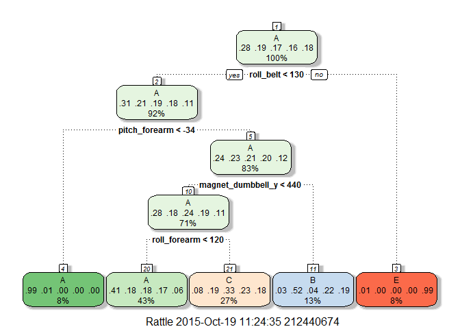
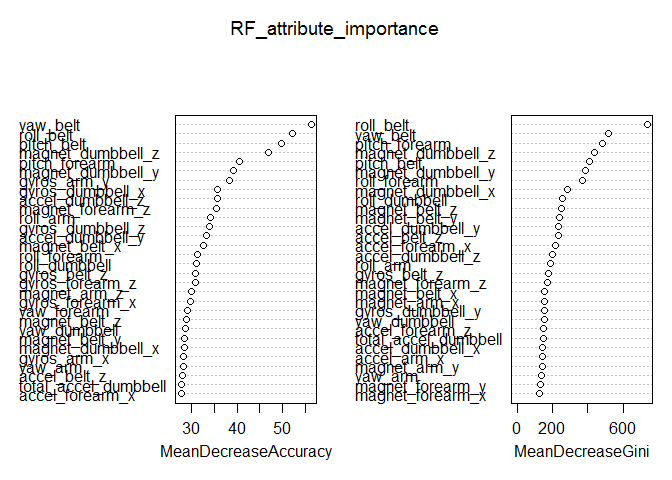

# JHU Coursera PML Course Project

# Synopsis

Given training and test excercise data, the purpose of this analysis is to 
use data from accelerometers on the belt, forearm, arm and dumbbell of six 
participants to develop prediction models on how well participants do the 
excercises.  Participants were asked to perform dumbbell lifts correctly
(classe A) and incorrectly (classes B,C,D,E) in five different ways: exactly
according to the specification (classe A), throwing the elbows to the front
(classe B), lifting the dumbbell only halfway (classe C), lowering the dumbbell
only halfway (classe D), and throwing the hips to the front (classe E). 
Participants were all males between 20 and 28 years of age with little weight
lifting experience.  A 1.25 kg dumbbell was used. 

# Data Processing

This section shows the data processing and analysis of the source data.

Load the required packages: 


```r
rm(list=ls()) # clears global environment
suppressMessages(library(AppliedPredictiveModeling))
suppressMessages(library(caret))
suppressMessages(library(rpart))
suppressMessages(library(ggplot2))
suppressMessages(library(rattle))
suppressMessages(library(randomForest))
```

### Load and preprocess the data

Training data (pml-training.csv) and test data (pml-test.csv) is loaded from
the working directory, replacing blanks with NAs:  


```r
pmltr = read.csv("pml-training.csv",header=TRUE,na.strings=c("","NA"))
pmlte = read.csv("pml-testing.csv",header=TRUE,na.strings=c("","NA"))
```

### Check the number of columns in the imported data set


```r
ncol(pmltr) # training set
```

```
## [1] 160
```

```r
ncol(pmlte) # test set
```

```
## [1] 160
```

### Clean the data

Eliminate any columns that contain NAs:


```r
pmltr=pmltr[,colSums(is.na(pmltr))==0]
pmlte=pmlte[,colSums(is.na(pmlte))==0]
```

Check column count for reduced data frames (no NAs):


```r
ncol(pmltr)
```

```
## [1] 60
```

```r
ncol(pmlte)
```

```
## [1] 60
```

Training and test sets each now have 60 columns.  The first seven columns can also be 
discarded because they contain no predictive information:


```r
pmltr=pmltr[,8:60]
pmlte=pmlte[,8:60]
pmlte=pmlte[,1:52] # drop the problem id column (column 53) out of test set
```

Check for high correlation between attributes to possibly reduce the number of 
attributes further.  Column 53 of the training set (pmltr) is the classe,
so drop that before checking for correlation:


```r
pmltr2=pmltr[,1:52]
pmltrcor<-cor(pmltr2)
summary(pmltrcor[upper.tri(pmltrcor)])
```

```
##      Min.   1st Qu.    Median      Mean   3rd Qu.      Max. 
## -0.992000 -0.110100  0.002092  0.001790  0.092550  0.980900
```

With a median cor=0.002 (no correlation) and 50% of correlations between
1Q = -.11 and 3Q = .092 (nearly no correlation), there doesn't appear to be 
many highly-correlated attributes, so I will leave the training set as is
(52 attributes).

### Create training and test sets from training data

Now create a 60%/40% train/test split from the training data:


```r
set.seed(5150)
trind<-createDataPartition(y=pmltr$classe,p=0.6,list=FALSE)
trn1<-pmltr[trind,] # this is the 60% of the training set for training
trn2<-pmltr[-trind,] # this is the 40% of the training set for testing
```

# Predictive models - Classification Tree and Random Forest

### Model 1 - Classification Tree

Using the 60% train subset, train a classification tree with k-fold cross validation.
The goal of cross validation is to "test" the model in the training phase in order to
limit problems like overfitting.  Larger k means less bias toward overestimating the true expected error (as training folds will be closer to the total dataset) but higher 
variance and higher running time.  To keep run time reasonable (especially with the next model - random forest), I am choosing k=5.     


```r
ctstart<-Sys.time()
ctree<-train(trn1$classe~.,trControl=trainControl(method="cv",number=5),data=trn1,method="rpart")
ctstop<-Sys.time()
ctduration<-ctstop-ctstart
print(ctree,digits=3)
```

```
## CART 
## 
## 11776 samples
##    52 predictor
##     5 classes: 'A', 'B', 'C', 'D', 'E' 
## 
## No pre-processing
## Resampling: Cross-Validated (5 fold) 
## Summary of sample sizes: 9421, 9421, 9420, 9420, 9422 
## Resampling results across tuning parameters:
## 
##   cp      Accuracy  Kappa  Accuracy SD  Kappa SD
##   0.0348  0.508     0.359  0.00652      0.00893 
##   0.0602  0.443     0.254  0.06655      0.11241 
##   0.1159  0.316     0.048  0.04290      0.06569 
## 
## Accuracy was used to select the optimal model using  the largest value.
## The final value used for the model was cp = 0.0348.
```

So classification tree accuracy is a coin flip: only about 50%.   

Required time to train the classification tree model: 


```r
ctduration
```

```
## Time difference of 14.96521 secs
```

Here is graphical representation of the classification tree:


```r
fancyRpartPlot(ctree$finalModel)
```

 

Per the classification tree, the roll_belt attribute, which is the tree root
node (appears first in the tree), has the highest amount of information gain
of all available attributes.

Check the classification tree confusion matrix on the 40% test set - note no
classe D itemsets were correctly binned: 


```r
predict2<-predict(ctree,newdata=trn2)
print(confusionMatrix(predict2,trn2$classe),digits=3)
```

```
## Confusion Matrix and Statistics
## 
##           Reference
## Prediction    A    B    C    D    E
##          A 2023  624  645  546  206
##          B   37  518   46  235  207
##          C  168  376  677  505  385
##          D    0    0    0    0    0
##          E    4    0    0    0  644
## 
## Overall Statistics
##                                         
##                Accuracy : 0.492         
##                  95% CI : (0.481, 0.503)
##     No Information Rate : 0.284         
##     P-Value [Acc > NIR] : <2e-16        
##                                         
##                   Kappa : 0.337         
##  Mcnemar's Test P-Value : NA            
## 
## Statistics by Class:
## 
##                      Class: A Class: B Class: C Class: D Class: E
## Sensitivity             0.906    0.341   0.4949    0.000   0.4466
## Specificity             0.640    0.917   0.7786    1.000   0.9994
## Pos Pred Value          0.500    0.497   0.3207      NaN   0.9938
## Neg Pred Value          0.945    0.853   0.8795    0.836   0.8891
## Prevalence              0.284    0.193   0.1744    0.164   0.1838
## Detection Rate          0.258    0.066   0.0863    0.000   0.0821
## Detection Prevalence    0.515    0.133   0.2691    0.000   0.0826
## Balanced Accuracy       0.773    0.629   0.6368    0.500   0.7230
```

### Model 2 - Random Forest

Using the 60% train subset, train a random forest model with 5-fold cross validation:


```r
rfstart<-Sys.time()
rfor<-train(trn1$classe~.,trControl=trainControl(method="cv",number=5),data=trn1,method="rf")
rfstop<-Sys.time()
rfduration<-rfstop-rfstart
print(rfor,digits=3)
```

```
## Random Forest 
## 
## 11776 samples
##    52 predictor
##     5 classes: 'A', 'B', 'C', 'D', 'E' 
## 
## No pre-processing
## Resampling: Cross-Validated (5 fold) 
## Summary of sample sizes: 9421, 9420, 9421, 9422, 9420 
## Resampling results across tuning parameters:
## 
##   mtry  Accuracy  Kappa  Accuracy SD  Kappa SD
##    2    0.990     0.987  0.00163      0.00206 
##   27    0.990     0.987  0.00240      0.00303 
##   52    0.984     0.979  0.00326      0.00412 
## 
## Accuracy was used to select the optimal model using  the largest value.
## The final value used for the model was mtry = 2.
```

Required time to train the random forest model: 


```r
rfduration
```

```
## Time difference of 10.26204 mins
```

So significantly more time required for the random forest model compared to 
the classification tree model.

Check the importance of each attribute in the random forest model:


```r
RF_attribute_importance<-randomForest(trn1$classe~.,trControl=trainControl(method="cv",number=5),data=trn1,importance=TRUE)
varImpPlot(RF_attribute_importance)
```

 

Per the random forest model, yaw belt and roll belt are the two most important
attributes for accuracy (MeanDecreaseAccuracy) and node purity (MeanDecreaseGini).

Check the random forest confusion matrix on the 40% test set: 


```r
predict3<-predict(rfor,newdata=trn2)
print(confusionMatrix(predict3,trn2$classe),digits=3)
```

```
## Confusion Matrix and Statistics
## 
##           Reference
## Prediction    A    B    C    D    E
##          A 2232    8    0    0    0
##          B    0 1500   20    0    0
##          C    0   10 1341   32    1
##          D    0    0    7 1252    7
##          E    0    0    0    2 1434
## 
## Overall Statistics
##                                         
##                Accuracy : 0.989         
##                  95% CI : (0.986, 0.991)
##     No Information Rate : 0.284         
##     P-Value [Acc > NIR] : <2e-16        
##                                         
##                   Kappa : 0.986         
##  Mcnemar's Test P-Value : NA            
## 
## Statistics by Class:
## 
##                      Class: A Class: B Class: C Class: D Class: E
## Sensitivity             1.000    0.988    0.980    0.974    0.994
## Specificity             0.999    0.997    0.993    0.998    1.000
## Pos Pred Value          0.996    0.987    0.969    0.989    0.999
## Neg Pred Value          1.000    0.997    0.996    0.995    0.999
## Prevalence              0.284    0.193    0.174    0.164    0.184
## Detection Rate          0.284    0.191    0.171    0.160    0.183
## Detection Prevalence    0.285    0.194    0.176    0.161    0.183
## Balanced Accuracy       0.999    0.992    0.987    0.986    0.997
```
Note most points are on the random forest confusion matrix diagonal (upper left
to lower right), indicating a good model (accuracy 98.9%).   

Run random forest on the 20 row test set for predictions: 


```r
print(predict(rfor,newdata=pmlte))
```

```
##  [1] B A B A A E D B A A B C B A E E A B B B
## Levels: A B C D E
```

### Out of Sample Error

Random forest model accuracy is 98.9%, so out of sample error is 1.00 - 0.989
= 1.1%.

# Conclusions

The random forest model (accuracy 98.9%) clearly beats the classification tree
model (accuracy 50%) in this analysis.

